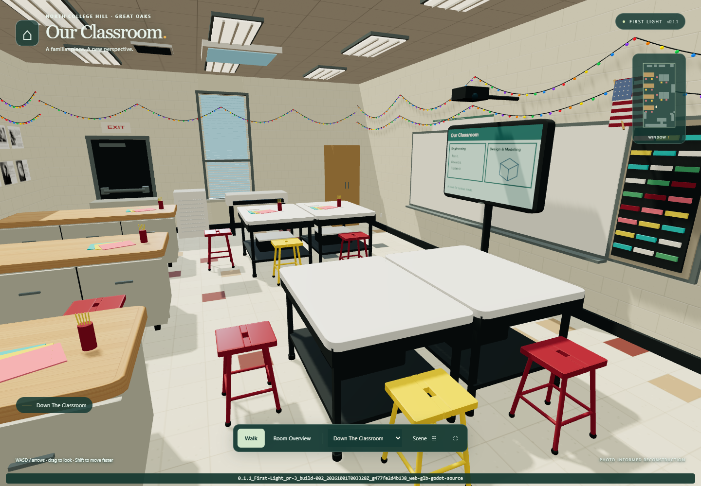

# Our Classroom · First Light

**A walkable, reusable 3D version of the North College Hill / Great Oaks classroom.**

Reconstructed from ten classroom photos, with cream block walls, a tiled ceiling,
wooden workbenches, four pale desks in two pairs, yellow and red stools, the ViewBoard teaching
wall, light strings, robotics shelves, a teacher nook and four printers.



## Walk Around

The release package contains `Classroom-Walkthrough.html`. Download it and open
it in a browser with WebGL 2. It is self-contained, works offline, and needs no
installation or local server. If an attachment preview does not run scripts,
save it and open it in your browser. On a phone, the hosted version is usually
more convenient than opening a downloaded HTML file.

- **WASD / arrows** move; **drag** looks around; **Shift** moves faster.
- “Walk into the classroom” captures the mouse on desktop; **Esc** releases it.
- **Room overview** opens an orbitable cutaway. Scroll or pinch to zoom.
- Use the viewpoint menu to jump to the board, benches, window or printer corner.
- **Scene** toggles room details, ceiling, lights, map and activity markers.
- **Place a lever example** puts a separate demonstration object on a workbench.
- On a phone, use the arrow pad and drag the scene to look.

## Use It In An Educational Game

| Deliverable | Use |
|---|---|
| `public/assets/classroom.glb` | Importable visual scene for Three.js, Godot, Blender and other glTF tools |
| `public/assets/classroom-layout.json` | Units, bounds, camera positions, attachment markers and collision boxes |
| `godot/classroom/classroom.tscn` | Native wrapper with collisions and `Marker3D` attachment points |
| `godot/project.godot` | Ready-to-open Godot walkthrough example |
| `src/classroom.js` | Editable procedural environment builder |

**One unit = one metre.** Room dimensions are estimated at 7 × 14 × 3.6 m. This
first pass is a recognizable stylized reconstruction, not a surveyed digital
twin. Reference limitations and inferred placements are in
[photo notes](docs/PHOTO-NOTES.md).

See the [integration guide](docs/INTEGRATION.md) for Three.js and Godot examples.
The environment has named anchors on tables and the floor; games keep their own
camera, input and simulation. The demo lever is static and is excluded from the
GLB. The existing lever-game repositories are not modified.

## Develop

The current draft is **0.1.1 First Light (development)**, extending the accepted
0.1.0 milestone with corrected classroom details, supplied quote posters and
rainbow string lights. Read [Build Identity](docs/BUILD_IDENTITY.md) before producing
an artifact. [Current Review](docs/CURRENT-REVIEW.md) identifies the exact tested package.

Node 22+:

```sh
npm ci
npm run dev
```

Open the loopback address printed in the terminal. `npm run build` creates the
hostable `dist/` folder and the self-contained HTML. Three.js is bundled locally;
there are no runtime CDN, font, analytics or network requirements.

After changing the model, run `npx playwright install chromium` once, then
`npm run review` to regenerate GLB, collision scene, browser bundle and identity manifests together. Set `CHROMIUM_EXECUTABLE` to an installed Chromium/Edge binary if needed. All 38 finished poster pages are embedded locally.

```sh
npm test
npm run build
npm run test:browser
```

Tests cover GLB validation and embedded assets, named anchors, spawn clearance,
collision tunnelling and sliding, actual browser movement, camera modes,
activity placement, downloads and touch controls. See
[verification notes](docs/VERIFICATION.md) for what was tested and remaining limits.

## Publish After Review

This repository includes a manual **Deploy Pages** workflow. Only after the owner approves a future deployment, choose **Settings → Pages → Source: GitHub Actions**, then
run **Actions → Deploy Pages → Run workflow** from `main`. The preview uses
relative URLs, so it works under the repository's Pages subpath. The previous **0.1.0 First Light** release is already live: PR #1 merged to
`1f25638e64861424a52f8bf381cea2a247cfe74e` and [Pages run 36637247202](https://github.com/AbbyUsesAIThatCodes/ClassroomVirtualization/actions/runs/36637247202)
succeeded on September 29, 2026. This draft does not merge or deploy anything.

See [Repository Status](docs/REPOSITORY-STATUS.md), [source provenance](docs/CLASSROOM-PROVENANCE.md),
[poster art provenance](docs/POSTER-ART.md), and the historical [recovery report](docs/recovery/2026-09-29.md).
Older source, HTML, GLB, Godot assets and evidence remain in Git history at the
baseline revision. Current exports and current review results are identified separately.

## Next Calibration Pass

A measured room width/length, ceiling height and one bench's dimensions will
provide a much stronger scale reference than photographs alone. Furniture can
then be adjusted against your walkthrough feedback. Beyond that, individual
game integrations can be added without changing this environment's contract.
